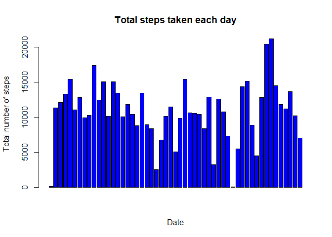
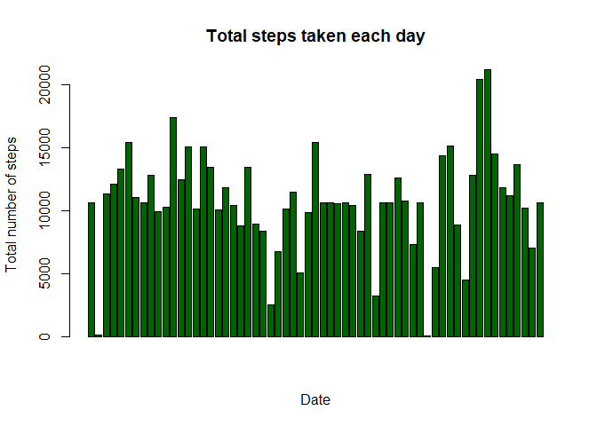
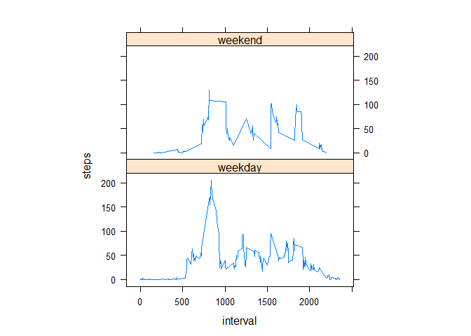

## Loading and preprocessing the data
####1. unzip if needed
####2. checking the structure in order to understand how to work with data

```r
if(!file.exists("activity.csv")){
  unzip("activity.zip")
}
data<-read.csv("activity.csv",header=TRUE)
names(data)
```

```
## [1] "steps"    "date"     "interval"
```

```r
str(data)
```

```
## 'data.frame':	17568 obs. of  3 variables:
##  $ steps   : int  NA NA NA NA NA NA NA NA NA NA ...
##  $ date    : Factor w/ 61 levels "2012-10-01","2012-10-02",..: 1 1 1 1 1 1 1 1 1 1 ...
##  $ interval: int  0 5 10 15 20 25 30 35 40 45 ...
```

```r
head(data)
```

```
##   steps       date interval
## 1    NA 2012-10-01        0
## 2    NA 2012-10-01        5
## 3    NA 2012-10-01       10
## 4    NA 2012-10-01       15
## 5    NA 2012-10-01       20
## 6    NA 2012-10-01       25
```


## What is mean total number of steps taken per day?
#### 1. Making a histogram of the total number of steps taken each day

```r
totalSTEPS<-aggregate(steps~date,data,sum,na.rm=TRUE)
barplot(totalSTEPS$steps,main ="Total steps taken each day",xlab="Date",ylab="Total number of steps",col="blue")
```

<!-- -->

#### 2. Calculting and reporting the mean and median total number of steps taken per day

```r
mean(totalSTEPS$steps)
```

```
## [1] 10766.19
```

```r
median(totalSTEPS$steps)
```

```
## [1] 10765
```


## What is the average daily activity pattern?
#### 1. Making a time series plot of the 5-minute interval and the average number of steps taken, averaged across all days
##### Creating dataset steps by interval

```r
stepsBYinterval <-aggregate (steps~interval, data, mean,na.rm=TRUE)
```

##### Generating the plot

```r
plot(steps~interval,stepsBYinterval,type="l")
```

<!-- -->


#### 2. Identifying 5-minute interval, with maximum number of steps on average across all the days in the dataset.

```r
stepsBYinterval[which.max(stepsBYinterval$steps),]$interval
```

```
## [1] 835
```


## Imputing missing values
####1. Calculating and reporting the total number of missing  values in the dataset.

```r
sum(is.na(data$steps))
```

```
## [1] 2304
```


####2. Filling the missing values strategy.
Using the mean for each interval which we have already calculated in previously. Stored under stepsBYinterval.

####3. Creating a new dataset with subsituted NA values.

```r
data2 <-merge(data, stepsBYinterval,by="interval", suffixes = c("",".y"))
data2$steps[is.na(data2$steps)]<-floor(data2$steps.y[is.na(data2$steps)])
data2<-data2[,!(names(data2) %in% c ("steps.y"))]
```
#### Checking if all NA values have been substituted, sum of NA values should be equal to 0.

```r
sum(is.na(data2$steps))
```

```
## [1] 0
```

####4. Making histogram, reporting mean and medin total number of steps taken per day. Shiwing the difference compare default dataset. Revealing impact of imputing missing data on the estimates of the total daily number of steps.

```r
totalSTEPS2<-aggregate(steps~date,data2,sum,na.rm=TRUE)
barplot(totalSTEPS2$steps,main ="Total steps taken each day",xlab="Date",ylab="Total number of steps",col="darkgreen")
```

<!-- -->

##### Calculting and reporting the mean and median total number of steps taken per day of the new dataset.

```r
mean(totalSTEPS2$steps)
```

```
## [1] 10749.77
```

```r
median(totalSTEPS2$steps)
```

```
## [1] 10641
```

####Concluding a difference between datasets
##### The mean slightly dropped down, same for median. This is due to added values for NA values.


## Are there differences in activity patterns between weekdays and weekends?
##### Creating new datasets, one for working days, other for weekend days.

```r
data2$day=ifelse(as.POSIXlt(as.Date(data$date))$wday%%6==0,"weekend","weekday")
data2$day=factor(data2$day,levels=c("weekday","weekend"))
stepsByinterval2=aggregate(steps~interval+day,data2,mean)
head(stepsByinterval2)
```

```
##   interval     day      steps
## 1        0 weekday 1.62295082
## 2        5 weekday 0.29508197
## 3       10 weekday 0.11475410
## 4       15 weekday 0.13114754
## 5       20 weekday 0.06557377
## 6       25 weekday 2.08196721
```

```r
library(lattice)
xyplot(steps~interval|factor(day),stepsByinterval2,aspect=1/2,type="l")
```

<!-- -->


